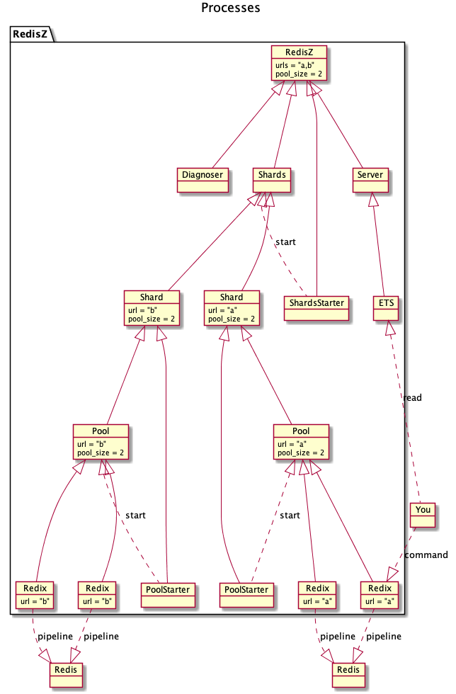

RedisZ - Redis Super
==
Full featured Redis adapter for Elixir based on [Redix][Redix].

* No downgrade from Redix: pipeline concurrency & auto reconnection.
* Parallel connection pooling.
* Sharding support.
* Auto reconnect at Amazon ElastiCache Multi-AZ failover.

※ This is beta quality.

Usage
--

Installation
--

Architecture
--

TODO
--
* [ ] Redis sentinel support.
* [ ] Redis cluster support.
* [ ] Online resharding.
* [ ] Controll connection pool size dynamically.
* [ ] Support commands for multiple shards.
* [ ] MULTI EXEC support.
* [ ] BLPOP BRPOP BRPOPLPUSH support.
* [ ] SCAN support
* [ ] ~~PubSub support.~~ Use [Redix.PubSub][Redix.PubSub] & [Phoenix.PubSub.RedisZ][Phoenix.PubSub.RedisZ].

[Redix]: https://hex.pm/packages/redix
[Redix.PubSub]: https://hex.pm/redix_pubsub
[Phoenix.PubSub.RedisZ]: https://hex.pm/packages/phoenix_pubsub_redis_z
